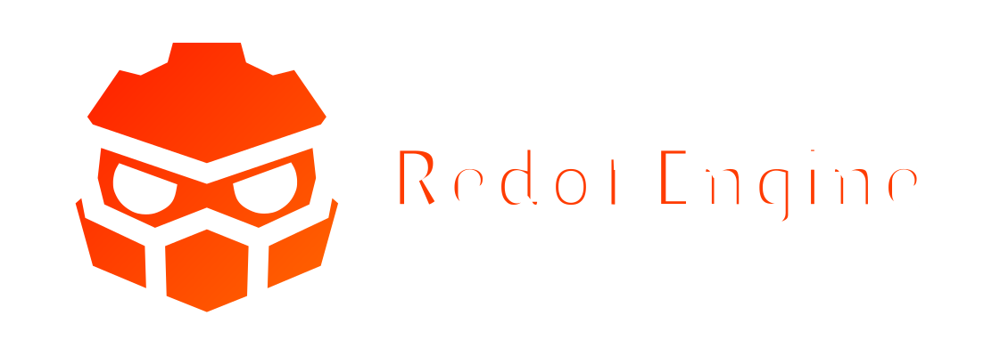

# Redot Engine

  

## 2D and 3D cross-platform game engine

**[Redot Engine](https://redotengine.org), fork of [Godot Engine](https://godotengine.org),  is a feature-packed, cross-platform
game engine to create 2D and 3D games from a unified interface.** It provides a
comprehensive set of [common tools](https://redotengine.org/features), so that
users can focus on making games without having to reinvent the wheel. Games can
be exported with one click to a number of platforms, including the major desktop
platforms (Linux, macOS, Windows), mobile platforms (Android, iOS), as well as
Web-based platforms and [consoles](https://docs.redotengine.org/en/latest/tutorials/platform/consoles.html).

## Free, open source and community-driven

Redot is completely free and open source under the very permissive [MIT license](https://redotengine.org/license).
No strings attached, no royalties, nothing. The users' games are theirs, down
to the last line of engine code. Redot's development is fully independent and
community-driven, empowering users to help shape their engine to match their
expectations.

Before being forked in [October 2024](https://github.com/Redot-Engine/redot-engine/commit/bac64b2b53a93c4ac57093eec3e900d79f4f3279),
Redot was originally developed as Godot by [Juan Linietsky](https://github.com/reduz) and
[Ariel Manzur](https://github.com/punto-) (both still maintaining the project)
for several years as an in-house engine, used to publish several work-for-hire
titles.

## Getting the engine

### Binary downloads

Official binaries for the Redot editor and the export templates can be found
[on the Redot website](https://redotengine.org/download).

### Compiling from source

[See the official docs](https://docs.redotengine.org/en/latest/contributing/development/compiling)
for compilation instructions for every supported platform.

## Community and contributing

Redot is not only an engine but an ever-growing community of users and engine
developers. The main community channels are listed [on the homepage](https://redotengine.org/community).

The best way to get in touch with the core engine developers is to join the
[Redot Contributors Chat](https://chat.redotengine.org).

To get started contributing to the project, see the [contributing guide](CONTRIBUTING.md).
This document also includes guidelines for reporting bugs.

## Documentation and demos

The official documentation is hosted on [Read the Docs](https://docs.redotengine.org).
It is maintained by the Redot community in its own [GitHub repository](https://github.com/redotengine/redot-docs).

The [class reference](https://docs.redotengine.org/en/latest/classes/)
is also accessible from the Redot editor.

We also maintain official demos in their own [GitHub repository](https://github.com/Redot-Engine/redot-demo-projects)
as well as a list of [awesome Redot community resources](https://github.com/Redot-Engine/redot-awesome).

There are also a number of other
[learning resources](https://docs.redotengine.org/en/latest/community/tutorials.html)
provided by the community, such as text and video tutorials, demos, etc.
Consult the [community channels](https://redotengine.org/community)
for more information.

